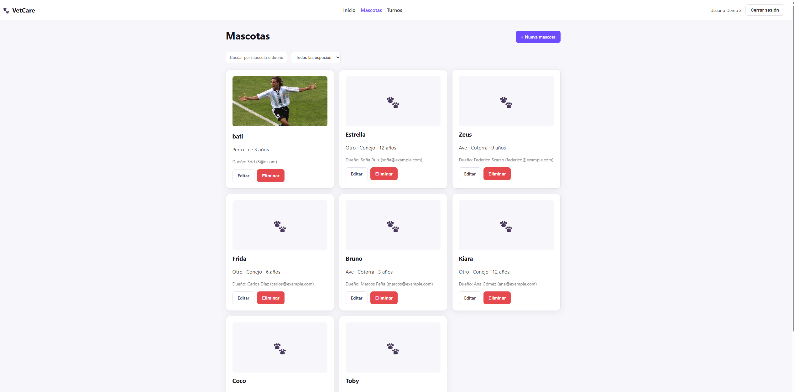
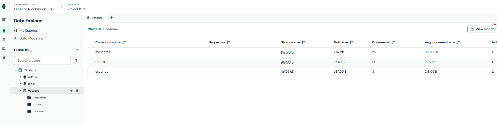

# VetCare

Aplicación web Full Stack para la gestión de una clínica veterinaria — mascotas y turnos — desarrollada como Examen Final de Plataformas de Desarrollo (Análisis de Sistemas).

## Integrantes

- Federico Nicolás Scarso

## Descripción

VetCare permite administrar las mascotas atendidas por la clínica y sus turnos. Cada mascota queda asociada a una cuenta de usuario del sistema: los usuarios con rol `user` solo pueden ver y gestionar las mascotas y turnos que ellos mismos cargaron, mientras que el rol `admin` tiene acceso total y puede reasignar la mascota a cualquier usuario. La autenticación se maneja con JWT y todas las operaciones de escritura (y de lectura de listados) requieren estar logueado.

## Temática elegida

Veterinaria — entidades relacionadas: **Mascota** y **Turno** (un turno pertenece a una mascota), más **Usuario** para la autenticación y los roles.

## Tecnologías utilizadas

**Backend**
- Node.js + Express
- MongoDB Atlas + Mongoose
- JWT (`jsonwebtoken`) para autenticación
- `bcryptjs` para hash de contraseñas
- `multer` para subida de imágenes
- `cors`, `dotenv`

**Frontend**
- React 19 (componentes funcionales + Hooks)
- React Router 7 (rutas y rutas protegidas)
- Axios (consumo de API)
- Context API (`AuthContext`, `ToastContext`)
- Vite
- CSS propio (sin librería de UI), con soporte de modo oscuro

## Funcionalidades

- CRUD completo de mascotas y turnos (GET, GET por ID, POST, PUT, DELETE).
- Login con JWT, logout, y rutas protegidas tanto en el backend (middleware) como en el frontend.
- **Roles de usuario**:
  - `admin`: ve, edita y elimina todas las mascotas/turnos, y puede asociar una mascota a cualquier usuario registrado.
  - `user`: solo ve, edita y elimina las mascotas/turnos que él mismo creó (validado en el backend, no solo ocultado en la UI).
- **Paginación** en los listados de mascotas y turnos (8 por página).
- **Subida de imágenes** de la mascota (se almacenan en el servidor y se sirven desde `/uploads`).
- Búsqueda y filtrado (mascotas por nombre/dueño y especie; turnos por estado).
- Confirmación antes de eliminar registros.
- Notificaciones visuales tipo toast.
- Modo oscuro: **sigue la preferencia del sistema operativo/navegador** (`prefers-color-scheme`), no tiene un toggle manual en la UI.
- Datos de prueba (dummy) cargables mediante un script de seed.

## Estructura del proyecto

```
Final/
├── backend/
│   ├── config/        # conexión a MongoDB
│   ├── models/        # Usuario, Mascota, Turno
│   ├── controllers/   # lógica de cada entidad
│   ├── routes/        # rutas de Express
│   ├── middleware/     # autenticación JWT y subida de imágenes
│   ├── uploads/        # imágenes subidas (no se versiona)
│   ├── seed.js          # carga de usuarios y datos dummy
│   └── server.js
└── frontend/
    └── src/
        ├── api/          # cliente axios
        ├── context/      # AuthContext, ToastContext
        ├── components/  # Navbar, PrivateRoute, Pagination, ConfirmDialog
        └── pages/        # Login, Inicio, Mascotas, Turnos, 404
```

## Instrucciones de instalación y ejecución

### Requisitos previos

- Node.js 18+
- Una base de datos MongoDB (Atlas o local)

### 1. Backend

```bash
cd Final/backend
npm install
cp .env.example .env   # completar con tus propios valores
npm run seed            # opcional: crea usuarios y datos de prueba
npm run dev              # o "npm start"
```

El backend queda escuchando en `http://localhost:4000` (o el puerto que definas en `PORT`).

### 2. Frontend

```bash
cd Final/frontend
npm install
cp .env.example .env   # completar si el backend no corre en localhost:4000
npm run dev
```

El frontend queda disponible en `http://localhost:5173`.

## Variables de entorno requeridas

**`Final/backend/.env`**

| Variable | Descripción |
|---|---|
| `PORT` | Puerto del servidor Express (ej. `4000`) |
| `MONGO_URI` | Connection string de MongoDB (Atlas o local) |
| `JWT_SECRET` | Secreto para firmar los tokens JWT |
| `JWT_EXPIRES_IN` | Vigencia del token (ej. `8h`) |

**`Final/frontend/.env`**

| Variable | Descripción |
|---|---|
| `VITE_API_URL` | URL base de la API (ej. `http://localhost:4000/api`) |

Ambos `.env` están excluidos del repositorio; se incluye un `.env.example` en cada carpeta como referencia.

## Usuarios de prueba

Se crean ejecutando `npm run seed` en `backend/`:

| Email | Contraseña | Rol |
|---|---|---|
| admin@vetcare.com | admin123 | admin |
| user@vetcare.com | user1234 | user |
| user2@vetcare.com | user1234 | user |

El seed también carga ~24 mascotas y ~18 turnos de ejemplo (repartidos entre estos usuarios) para poder ver la paginación y el scoping por rol en acción. Es idempotente: se puede volver a correr sin duplicar datos.

## Capturas de pantalla




## Enlace a la aplicación publicada

No se realizó despliegue (backend/frontend corren localmente). La base de datos sí está en MongoDB Atlas.
